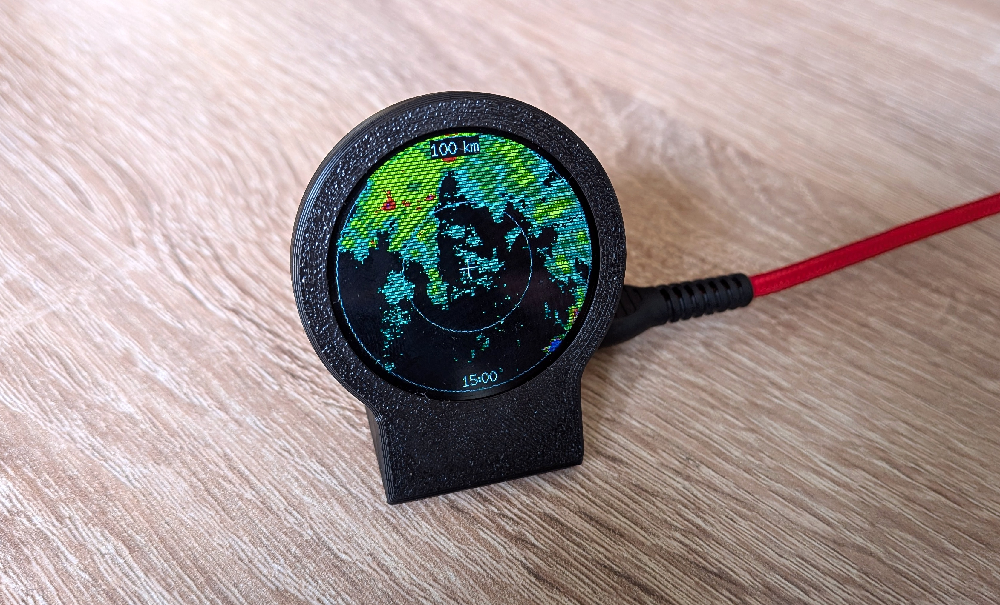

# CHMI Radar pro ESP32-C3

Jednoduchý meteorologický radar postavený na **ESP32-C3** a kulatém **240×240 LCD displeji (GC9A01)**. Nevyžaduje žádné další součístky.
Zařízení pravidelně stahuje nejnovější radarový snímek z otevřených dat **Českého hydrometeorologického ústavu (ČHMÚ)** a zobrazuje okolí zadané polohy v několika úrovních přiblížení.

Více na webu https://www.petanovo.cz/esp-meteoradar-od-letadel-k-meteo-radarovym-datum/
3D model: https://makerworld.com/cs/models/2872376-esp32-plane-radar-live-ads-b-on-a-round-display#profileId-3207083

<p align="center">
    
</p>

---

## Funkce

- 🌧️ Stahování nejnovějších radarových snímků ČHMÚ
- 📡 Automatická aktualizace každých 2,5 minuty
- 📍 Nastavení vlastní polohy (zeměpisná šířka a délka)
- 🔍 Přepínání zoomu:
  - 10 km
  - 25 km
  - 50 km
  - 100 km
- 📶 Konfigurace WiFi pomocí **WiFiManageru**
- 💾 Uložení nastavení do interní paměti ESP32 (Preferences)
- 🕒 Nastavitelný časový posun zobrazeného času radarového snímku
- 🔘 Ovládání jedním tlačítkem
- 🖥️ Podpora kulatého displeje GC9A01 (240×240)

---

# Použitý hardware

- ESP32-C3
- Kulatý TFT displej GC9A01 (240×240)
- Jedno tlačítko (součástí ESP32-C3 Super Mini)

---

# Zapojení

## Displej

| Displej | ESP32-C3 |
|----------|-----------|
| MOSI | GPIO3 |
| SCLK | GPIO4 |
| CS | GPIO1 |
| DC | GPIO10 |
| RESET | GPIO0 |

## Tlačítko

| Tlačítko | ESP32-C3 |
|-----------|-----------|
| Jeden kontakt | GPIO9 |
| Druhý kontakt | GND |

V programu je použit interní **pull-up** rezistor. Toto tlačítko je integrováno přío na desce ESP32-C2 Super Mini jako tlačítko BOOT

---

# Ovládání

## Krátký stisk tlačítka

Přepíná rozsah radaru:

```
10 km → 25 km → 50 km → 100 km
```

## Dlouhý stisk (cca 3 sekundy)

Vymaže uložené nastavení a znovu spustí WiFiManager.

---

# Konfigurace

Při prvním spuštění (nebo po dlouhém podržení tlačítka) se vytvoří WiFi síť:

```
ESP-MeteoRadar
```

Po připojení lze nastavit:

- WiFi síť
- heslo
- zeměpisnou šířku
- zeměpisnou délku
- výchozí zoom
- časový posun zobrazeného času (+1 hodina v zimě, +2 hodiny v létě)

Veškeré nastavení je uloženo do interní paměti ESP32.

---

# Zdroj radarových dat

Projekt využívá otevřená data Českého hydrometeorologického ústavu (ČHMÚ):

https://opendata.chmi.cz/

---

# Použité knihovny

- LovyanGFX
- PNGdec
- WiFiManager
- Preferences

---

# Možná budoucí rozšíření

- mapa České republiky jako podklad
- zobrazení světových stran
- názvy větších měst
- legenda intenzity srážek
- OTA aktualizace firmware
- animace posledních radarových snímků

---

# Licence

Projekt je uvolněn pod licencí **MIT**.
