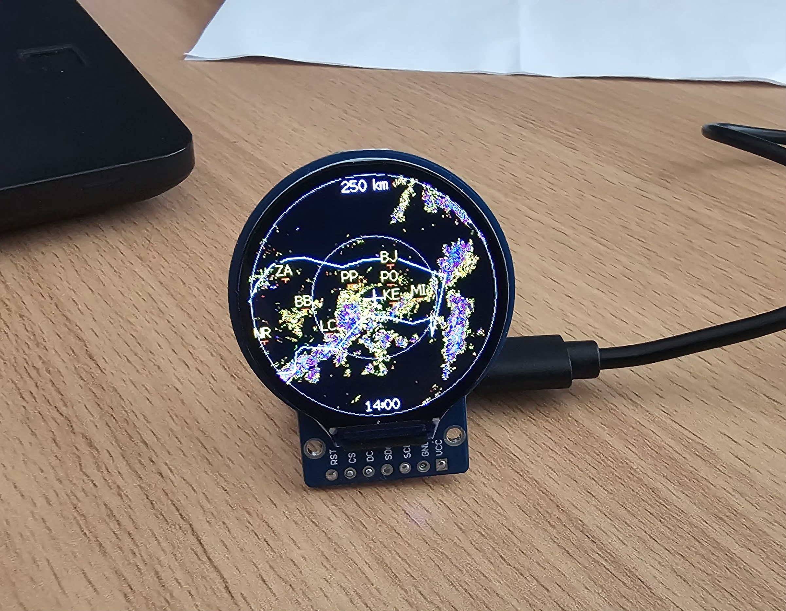

# SHMÚ Radar & ADSB Plane Radar pre ESP32-C3 (Slovensko)

Kompaktné multifunkčné zariadenie postavené na **ESP32-C3** a okrúhlom **240×240 LCD displeji (GC9A01)**. Zariadenie kombinuje živé sledovanie zrážkového počasia zo Slovenského hydrometeorologického ústavu (**SHMÚ**) a reálny letecký radar s dátami z otvorených API (**ADSB.fi**).

Súčasťou zobrazenia je detailná vektorová **mapa štátnej hranice Slovenska**, názvy a značky **kľúčových miest**, rozsahové kruhy a živé textové overlays.

Pôvodný projekt (pre Česko): https://www.petanovo.cz/esp-meteoradar-od-letadel-k-meteo-radarovym-datum/

3D model krabičky: https://makerworld.com/cs/models/2872376-esp32-plane-radar-live-ads-b-on-a-round-display#profileId-3207083

    

---

## 🚀 Hlavné funkcie

- 🔄 **Karuselový režim (Carousel Mode):** Automatické striedanie dvoch hlavných režimov v 30-sekundových intervaloch:
  - **Meteorologický radar (SHMÚ):** Sťahovanie a resampling najnovších CMAX snímok zrážok.
  - **Letecký radar (ADSB):** Živé sledovanie lietadiel v okolí zvolenej polohy.
- ✈️ **Pokročilé zobrazenie lietadiel:**
  - **Prehľadné 3-riadkové štítky:** Vertikálne zarovnané a farebne odlíšené dáta — Callsign (biela/červená), Typ lietadla (svetlomodrá) a Výška v metroch (žltá).
  - **Inteligentné zobrazovanie trás:** Zobrazenie kódov letísk (`PRG-BTS`), ak sú dostupné v API (pri chýbajúcich dátach sa riadok skryje).
  - **Zvýraznenie vojenských letov:** Vojenské transpondéry sa automaticky zobrazujú s červeným symbolom a štítkom.
  - **Indikátory stúpania/klesania:** Farebné vertikálne šípky ukazujúce zmenu výšky (vrate).
  - **Vektorový symbol lietadla:** Vykreslenie nosa lietadla podľa kurzu a čiary smeru pohybu.
- 🌧️ **Živé dáta SHMÚ:** Automatické sťahovanie najnovších kompozitných radarových snímok z open-data portálu SHMÚ.
- 🗺️ **Detailná Vektorová mapa SR & Mesta:** Vylepšený polygón štátnej hranice s dvojnásobnou hustotou bodov pre plynulú siluetu Slovenska spolu s dynamickým filtrom miest podľa zoomu.
- ⚡ **Bleskový štart & plynulé vykresľovanie:** Rozhranie sa zobrazí ihneď po pripojení k Wi-Fi, dáta sa sťahujú na pozadí bez nepríjemného blikania obrazovky.
- 🔍 **Plynulý zoom:** 5 úrovní priblíženia radaru (10 km, 25 km, 50 km, 100 km a 250 km pre celé SR).
- 📶 **WiFiManager & NVS:** Nastavenie Wi-Fi siete, GPS polohy a časového offsetu cez webový portál s trvalým ukladaním do pamäte.
- 🔘 **Jedno tlačidlo:** Krátkym stlačením prepína zoom, dlhým podržaním vyvolá reset Wi-Fi a nastavení.

---

# 🛠️ Použitý hardware & knižnice

### Hardvér
- **ESP32-C3 SuperMini** (príp. ekvivalentná doska s ESP32-C3)
- Okrúhly TFT displej **GC9A01** (240×240 pixelov, SPI rozhranie)
- Integrované tlačidlo (priamo na doske SuperMini ako BOOT tlačidlo na GPIO9)

### Software Stack (PlatformIO)
- **LovyanGFX:** Ultra-rýchle vykresľovanie grafiky a práca s textom/fontmi.
- **ArduinoJson:** Efektívne filtrovanie a parsovanie JSON streamu z ADSB API.
- **PNGdec:** Dekódovanie a resamplovanie PNG snímok zo SPIFFS pamäte.
- **WiFiManager:** Správa Wi-Fi pripojenia a konfiguračného portálu.
- **Preferences:** Ukladanie používateľských nastavení do NVS pamäte.

---

# 🔌 Zapojenie

## Displej (GC9A01)

| Displej | ESP32-C3 Pin | Popis |
| :--- | :--- | :--- |
| **MOSI** | GPIO3 | SPI Data Out |
| **SCLK** | GPIO4 | SPI Clock |
| **CS** | GPIO1 | Chip Select |
| **DC** | GPIO10 | Data / Command |
| **RESET** | GPIO0 | Hardware Reset |
| **BLN / VCC** | 3.3V | Napájanie displeja |
| **GND** | GND | Zostava zeme |

## Tlačidlo

| Tlačidlo | ESP32-C3 Pin |
| :--- | :--- |
| **Jeden kontakt** | GPIO9 (Tlačidlo BOOT) |
| **Druhý kontakt** | GND |

> *Poznámka: V kóde je softvérovo aktivovaný vnútorný `INPUT_PULLUP`, nie sú nutné externé rezistory.*

---

# 🕹️ Ovládanie

- **Krátke stlačenie tlačidla:** Prepína rozsah (radius) radaru v cykle:
  $$\text{10 km} \rightarrow \text{25 km} \rightarrow \text{50 km} \rightarrow \text{100 km} \rightarrow \text{250 km}$$
- **Dlhé stlačenie (podržanie ≥ 3 sekundy):** Vymaže uložené dáta v pamäti, vyresetuje WiFiManager a reštartuje zariadenie do režimu konfiguračného portálu.

---

# ⚙️ Konfigurácia a prvé spustenie

1. Po prvom zapnutí (alebo resete) zariadenie vytvorí otvorenú Wi-Fi sieť s názvom **`ESPMeteoRadar`**.
2. Pripojte sa k tejto sieti mobilom alebo PC. Automaticky vyskočí konfiguračná stránka (príp. prejdite na `192.168.4.1`).
3. Vyberte svoju Wi-Fi sieť, zadajte heslo a doplňte voliteľné parametre:
   - **Zemepisná šírka / Latitude** (napr. `49.2918` pre Bardejov, `48.1486` pre Bratislavu)
   - **Zemepisná dĺžka / Longitude** (napr. `21.2727` pre Bardejov, `17.1077` pre Bratislavu)
   - **Predvolený rozsah km** (`10`, `25`, `50`, `100` alebo `250`)
   - **Časový offset** (`1` pre zimu, `2` pre letný čas)
4. Zariadenie sa reštartuje, uloží parametre do flash pamäte a spustí karuselový režim.

---

# 🌐 Jednoduchá inštalácia cez webový prehliadač (Web Flash)

Ak nechceš kompilovať kód vo VS Code / PlatformIO, môžeš firmware nainštalovať priamo z prehliadača cez USB kábel bez inštalácie akéhokoľvek softvéru.

### Potrebuješ:
* Prehliadač podporujúci **Web Serial** (Google Chrome, Microsoft Edge alebo Opera).
* USB kábel pripojený k ESP32-C3 SuperMini.
* Zlúčený firmware binárny súbor (`merged_firmware.bin`), stiahnutý zo záložky **Releases**.

### Návod na inštaláciu:

1. **Stiahnutie:** Prejdi do sekcie **Releases** v tomto repozitári a stiahni si najnovší súbor `merged_firmware.bin`.
2. **Otvorenie webu:** Otvor stránku [web.esphome.io](https://web.esphome.io/) v podporovanom prehliadači.
3. **Pripojenie:** Klikni na tlačidlo **CONNECT**.
4. **Výber portu:** V vyskakovacom okne vyber sériový port priradený tvojmu ESP32-C3 (napr. `COM3` na Windows alebo `/dev/ttyACM0` na Linuxe/Macu) a potvrď pripojenie.
   > *Poznámka: Ak sa zariadenie nedokáže pripojiť, podrž na doske tlačidlo **BOOT (GPIO9)**, stlač **RESET** a pusti BOOT pre vstup do bootloader režimu.*
5. **Nahratie:** Po úspešnom pripojení zvoľ možnosť **INSTALL** (alebo **Prepare for adoption / Install custom binary**), vyber stiahnutý `.bin` súbor zo svojho počítača a potvrď **INSTALL**.
6. **Dokončenie:** Počkaj, kým priebeh dosiahne 100 %. Po reštarte zariadenie vytvorí Wi-Fi sieť `ESPMeteoRadar` pre prvotné nastavenie.

---

# 📦 Inštalácia a kompilácia cez PlatformIO

Projekt je pripravený pre vývojové prostredie **VS Code + PlatformIO**.

1. Klonujte alebo stiahnite tento repozitár.
2. Otvorte priečinok projektu v aplikácii **Visual Studio Code**.
3. PlatformIO automaticky detekuje závislosti definované v `platformio.ini`:
   - `LovyanGFX`
   - `PNGdec`
   - `WiFiManager`
   - `ArduinoJson`
   - `Preferences`
4. Pripojte ESP32-C3 k PC cez USB kábel, kliknite na ikonu **Build** ($\checkmark$) a následne **Upload** ($\rightarrow$) v spodnej lište PlatformIO.

---

# 📚 Zdroj dát a poďakovanie

- **Meteorologické dáta:** Slovenský hydrometeorologický ústav (SHMÚ) – [Open Data SHMÚ](https://opendata.shmu.sk/)
- **Letecké dáta (ADSB):** [ADSB.fi Open Data API](https://opendata.adsb.fi/)
- **Inšpirácia a pôvodný koncept:** [Petanovo.cz](https://www.petanovo.cz/)

---

# 📄 Licencia

Tento projekt je šírený pod licenciou **MIT**. Voľne upravené a prispôsobené pre podmienky Slovenskej republiky.